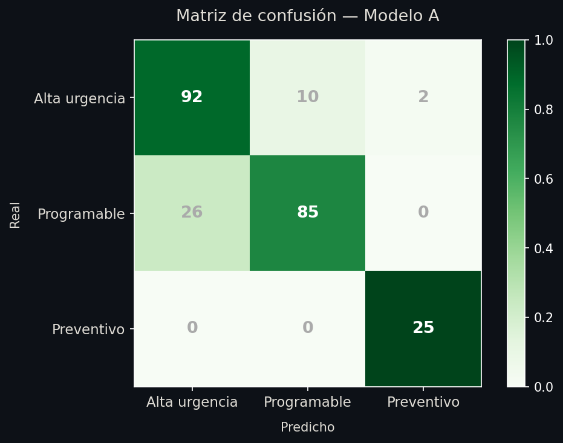
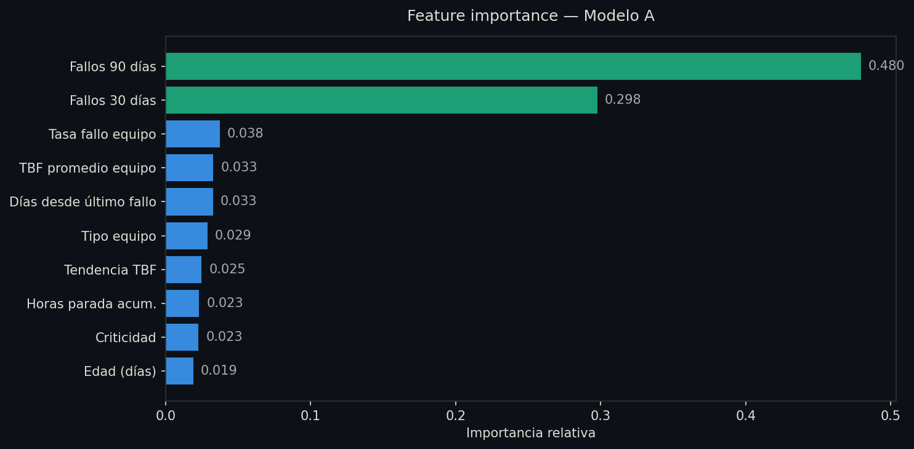
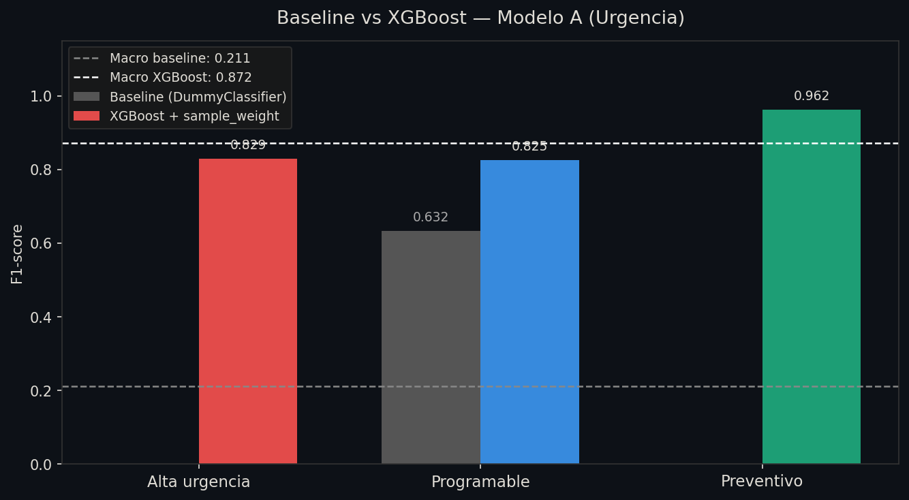
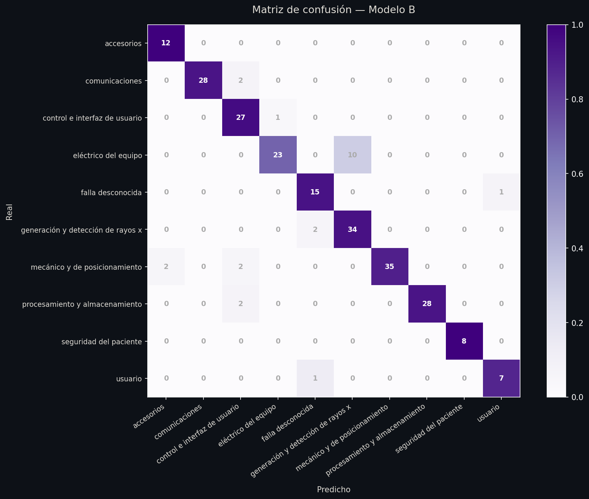
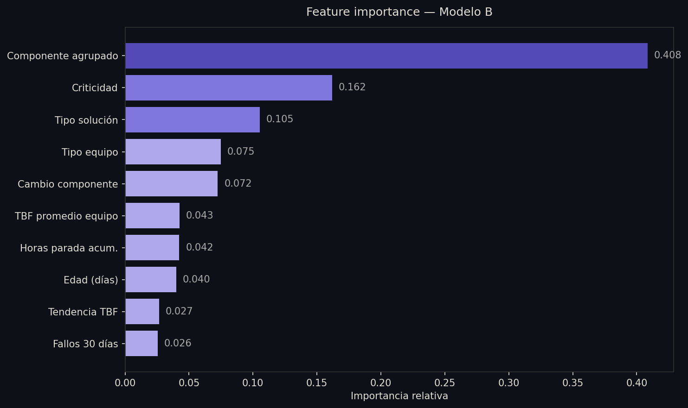
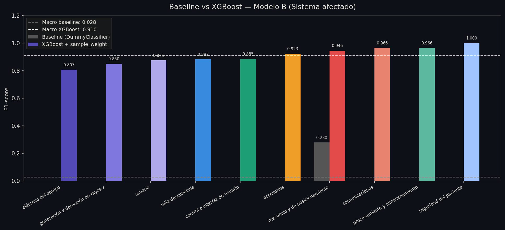
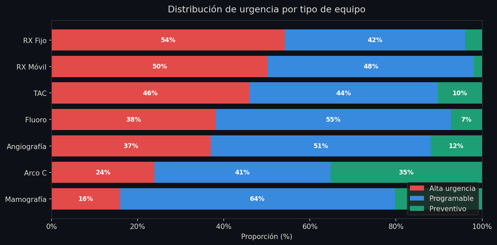

# Sistema de Mantenimiento Predictivo — Equipos de Imagenología Médica

> Pipeline de Machine Learning para predecir fallos en equipos de imagenología médica mediante dos modelos XGBoost independientes para urgencia y sistema afectado.

**Desarrollado en:** Universidad Autónoma de Occidente · Ingeniería Biomédica  
**Período del dataset:** 2020 – 2025  
**Entorno de ejecución:** Google Colab

---

## Descripción general

Este sistema analiza **1.230 órdenes de mantenimiento correctivo** de siete tipos de equipos de imagenología (TAC, Angiografía, Fluoroscopía, RX Fijo, RX Móvil, Arco C y Mamografía) para predecir, ante un nuevo evento de fallo:

1. **¿Cuándo volverá a fallar el equipo?** → clasificado en tres niveles de urgencia operacional.
2. **¿Qué sistema del equipo fallará?** → identificado entre 10 categorías técnicas.

El objetivo no es predicción en tiempo real sino la construcción de **checklists de mantenimiento preventivo** basados en evidencia histórica, validados por modelos predictivos con F1-macro > 0.87.

---

## Resultados

| Modelo | Target | Clases | F1-macro baseline | F1-macro XGBoost | Mejora |
|--------|--------|--------|:-----------------:|:----------------:|:------:|
| **Modelo A** | Periodo de fallo | 3 | 0.211 | **0.872** | +0.661 |
| **Modelo B** | Sistema afectado | 10 | 0.028 | **0.910** | +0.882 |

**Exact Match conjunto** (ambos modelos aciertan en el mismo registro): calculado por tipo de equipo en Celda 26.

---

## Arquitectura del pipeline

```
Excel del hospital
        │
        ▼
┌─────────────────────────────────┐
│  Bloque 1 — Pre-procesamiento   │
│  · Limpieza y estandarización   │
│  · Cálculo de TBF               │
│  · Índice de criticidad (1-5)   │
│  · Features temporales          │
│  · df_modelo: 1.199 registros   │
└────────────┬────────────────────┘
             │
             ▼
┌─────────────────────────────────┐
│  Bloque 2 — EDA                 │
│  · Distribución de targets      │
│  · UMAP 2D/3D (Modelo A y B)    │
│  · Agrupación de componentes    │
│  · Curva de supervivencia       │
└────────────┬────────────────────┘
             │
             ▼
┌─────────────────────────────────┐
│  Bloque 3 — Modelado            │
│  · DummyClassifier (baseline)   │
│  · Modelo A: XGBoost 3 clases   │
│  · Modelo B: XGBoost 10 clases  │
└────────────┬────────────────────┘
             │
             ▼
┌─────────────────────────────────┐
│  Bloque 4 — Exportación         │
│  · Artefactos .ubj y .pkl       │
│  · Imágenes PNG                 │
│  · Visualizaciones comparativas │
└────────────┬────────────────────┘
             │
             ▼
┌─────────────────────────────────┐
│  Bloque 5 — Validación          │
│  · Validación cruzada 5-fold    │
│  · Robustez con ruido gaussiano │
│  · Experimento SMOTE            │
└────────────┬────────────────────┘
             │
             ▼
┌─────────────────────────────────┐
│  Bloque 6 — Protocolos          │
│  · Tabla maestra tipo×urgencia  │
│  · Semáforo de confianza        │
│  · Check lists por equipo       │
└─────────────────────────────────┘
```

---

## Estructura del notebook

### Bloque 1 — Preprocesamiento (Celdas 1–7)
- **Celda 1** — Carga del archivo Excel desde Google Colab
- **Celda 2** — Estandarización de nombres de columnas
- **Celda 2b** — Limpieza de columnas de texto y corrección de `sistema_general`
- **Celda 3** — Limpieza de horas de parada (imputación con 0)
- **Celda 4** — Variable binaria `hubo_cambio_componente`
- **Celda 5** — Índice de criticidad 1–5 por equipo × sistema
- **Celda 6** — Variables temporales: TBF, edad, fallos acumulados
- **Celda 7** — Preparación final del dataset (`df_modelo`, 1.199 registros)

### Bloque 2 — EDA (Celdas 8–19)
- **Celda 8** — Target `periodo_fallo` (Alta urgencia 43% · Programable 46% · Preventivo 10%)
- **Celda 9** — Target `sistema_general_target` (10 clases, umbral mínimo 30 registros)
- **Celda 10** — Resumen interactivo por equipo
- **Celdas 11–12** — Variables de entrada Modelo A y B
- **Celda 13** — Distribución del target `periodo_fallo`
- **Celda 14** — Distribución TBF: histograma, medianas, boxplot, curva de supervivencia
- **Celda 15** — Outliers en features numéricas
- **Celda 16** — Agrupación de componentes (`componente_agrupado`) con fuzzy matching
- **Celdas 17–19** — Variables Modelo B, distribución sistema, UMAP 2D/3D

### Bloque 3 — Modelado (Celdas 20–22)
- **Celda 20** — Baseline DummyClassifier (F1-macro A: 0.211 · B: 0.028)
- **Celda 21** — Modelo A: XGBoost, 10 features, F1-macro 0.872
- **Celda 22** — Modelo B: XGBoost, 10 features, F1-macro 0.910

### Bloque 4 — Exportación (Celdas 23a–23c)
- **Celda 23a** — Descarga artefactos: `modelo_a.ubj`, `modelo_b.ubj`, encoders y mapas
- **Celda 23b** — Matrices de confusión y feature importance en PNG
- **Celda 23c** — Comparativa baseline vs XGBoost + distribución urgencia por equipo

### Bloque 5 — Validación (Celdas 24–25)
- **Celda 24** — Validación cruzada 5-fold + robustez con ruido gaussiano (5%–30% std)
- **Celda 25** — Experimento SMOTE: total y parcial (60%), justificación de no uso

### Bloque 6 — Protocolos (Celdas 26–27)
- **Celda 26** — Tabla maestra: tipo × urgencia × sistema con Exact Match, CV por equipo, componente que falló más frecuente, tipo de solución y semáforo F1 + n_casos
- **Celda 27** — Checklist operativo por tipo de equipo ordenado por nivel de riesgo

---

## Equipos y sistemas cubiertos

**Tipos de equipo analizados:**

| Nombre corto | Nombre completo |
|--------------|-----------------|
| RX Fijo | Unidad Radiográfica Digital |
| RX Móvil | Unidad Radiográfica Móvil |
| Mamografía | Unidad Radiográfica Mamográfica |
| Arco C | Unidad Radiográfica/Fluoroscópica Móvil |
| TAC | Sis Exploración Tomografía Computarizada |
| Fluoroscopía | Sistema radiográfico/fluoroscópico |
| Angiografía | Sist Radiográf/Fluorosc Para Angiografía |

**Sistemas afectados (clases Modelo B):**

- Mecánico y de posicionamiento
- Generación y detección de rayos X
- Eléctrico del equipo
- Control e interfaz de usuario
- Procesamiento y almacenamiento
- Comunicaciones
- Falla desconocida
- Seguridad del paciente
- Usuario
- Accesorios

---

## Features del modelo

### Modelo A — Periodo de fallo (10 features)

| Feature | Tipo | Descripción |
|---------|------|-------------|
| `fallos_30_dias` | Numérica | Fallos del equipo en los últimos 30 días |
| `fallos_90_dias` | Numérica | Fallos del equipo en los últimos 90 días |
| `tbf_promedio_equipo` | Numérica | TBF promedio histórico hasta ese evento |
| `tendencia_tbf` | Numérica | Desviación del TBF actual vs. histórico |
| `tasa_fallo_equipo` | Numérica | Fallos acumulados / edad en días |
| `dias_desde_ultimo_fallo` | Numérica | Días desde el fallo anterior |
| `criticidad` | Numérica | Índice compuesto de gravedad (1–5) |
| `edad_dias` | Numérica | Días instalado al momento del fallo |
| `horas_parada_acumuladas` | Numérica | Total horas fuera de servicio acumuladas |
| `tipo_equipo` | Categórica | Tipo de equipo médico |

### Modelo B — Sistema afectado (10 features)

| Feature | Tipo | Descripción |
|---------|------|-------------|
| `componente_agrupado` | Categórica | Sistema al que pertenece el componente que falló |
| `tipo_equipo` | Categórica | Tipo de equipo médico |
| `tipo_solucion` | Categórica | Tipo de solución aplicada |
| `hubo_cambio_componente` | Binaria | Si se reemplazó algún componente |
| `criticidad` | Numérica | Índice de gravedad (1–5) |
| `fallos_30_dias` | Numérica | Fallos en los últimos 30 días |
| `edad_dias` | Numérica | Días instalado al momento del fallo |
| `tbf_promedio_equipo` | Numérica | TBF promedio histórico |
| `tendencia_tbf` | Numérica | Deterioro o mejora reciente |
| `horas_parada_acumuladas` | Numérica | Total horas fuera de servicio |

**Variable más importante Modelo B:** `componente_agrupado` — elevó F1-macro de 0.596 a 0.910.

---

## Análisis exploratorio destacado

- **Asimetría TBF = 4.31** → justifica clasificación sobre regresión
- **P(fallo ≤ 15 días) = 42.9%** → caída casi vertical en curva de supervivencia
- **P(fallo ≤ 90 días) = 89.7%** → el 90% de los equipos falla antes de 3 meses
- **Silhouette Score negativo** (UMAP) → no hay separabilidad lineal entre clases → justifica XGBoost no lineal

---

## Experimentos adicionales

| Experimento | Resultado | Conclusión |
|-------------|-----------|------------|
| Classifier Chain A→B | F1-B: 0.767 | ↓ Targets independientes, no mejora |
| Classifier Chain B→A | F1-A: degradado | ↓ No mejora |
| CatBoost Modelo B | F1: 0.806 | ↓ XGBoost más robusto globalmente |
| SMOTE total | Gap aumenta +0.021 | ↓ Descartado |
| SMOTE parcial 60% | Gap aumenta +0.018 | ↓ Descartado |

> **Hallazgo clave:** Los targets `periodo_fallo` y `sistema_general` son prácticamente independientes. La Classifier Chain se documentó como experimento metodológico válido pero sin ganancia en este dataset. `compute_sample_weight("balanced")` supera a SMOTE preservando la distribución real de fallas.

---

## Archivos generados

| Archivo | Descripción |
|---------|-------------|
| `tabla_maestra_con_semaforo.csv` | Base empírica: tipo × urgencia × sistema con métricas históricas y semáforo |
| `tabla_reclasificada_f1.csv` | Cada sistema en su única categoría de riesgo + semáforo F1 Modelo B |
| `checklist_base.csv` | Checklist completa por tipo de equipo con acciones y tiempos |
| `modelo_a.ubj` | Clasificador urgencia (XGBoost formato nativo) |
| `modelo_b.ubj` | Clasificador sistema (XGBoost formato nativo) |
| `enc_a.pkl` | OrdinalEncoder features Modelo A |
| `enc_b.pkl` | OrdinalEncoder features Modelo B |
| `le_b.pkl` | LabelEncoder target Modelo B |
| `mapa_periodo.pkl` | Mapa clases Modelo A |

---

## Semáforo de confianza

Los protocolos y checklists se asignan a una de tres categorías basadas en F1 del Modelo B por sistema y número de casos históricos:

| Semáforo | Criterio | Acción recomendada |
|----------|----------|--------------------|
| 🟢 **VERDE** | F1 ≥ 0.85 y N ≥ 5 | Protocolo activable automáticamente |
| 🟡 **AMARILLO** | F1 ≥ 0.70 y N ≥ 3 | Checklist con validación del técnico |
| 🔴 **ROJO** | F1 bajo o N insuficiente | Checklist preventiva genérica + criterio experto |

---

## Requisitos

```python
pandas
numpy
scikit-learn
xgboost
umap-learn
plotly
matplotlib
rapidfuzz
imbalanced-learn
joblib
```

Instalar en Colab:

```bash
pip install xgboost umap-learn plotly rapidfuzz imbalanced-learn
```

---

## Cómo ejecutar

1. Abrir el notebook en Google Colab
2. Ejecutar las celdas en orden secuencial (Bloques 1 → 6)
3. En **Celda 1** subir el archivo Excel de órdenes de mantenimiento cuando se solicite
4. Los artefactos y checklists se descargan automáticamente en los Bloques 4 y 6

> El dataset del hospital no se incluye en este repositorio por restricciones de confidencialidad clínica.

---


## Resultados visuales

### Modelo A — Urgencia




### Modelo B — Sistema afectado




### Distribución por equipo


---


## Limitaciones

- Dataset de un único hospital — la generalización a otras instituciones requiere reentrenamiento
- Clases minoritarias con pocos registros: `usuario` y `seguridad del paciente`
- Los modelos están entrenados sobre datos 2020–2025 de FVL exclusivamente

---

## Trabajo futuro

- [ ] Ampliar dataset con datos de nuevos equipos incorporados al hospital
- [ ] Despliegue como API REST para integración con sistemas CMMS del hospital
- [ ] Extensión del protocolo a equipos no ionizantes (ultrasonido, resonancia magnética)
- [ ] Validación prospectiva del checklist con el equipo de ingeniería clínica de FVL

---

## Autoras


**Laura Camila Vargas Delgado** · Ingeniería Biomédica · Universidad Autónoma de Occidente  
**Valeria Mosquera Amador** · Ingeniería Biomédica · Universidad Autónoma de Occidente  
Semillero RIDGE — Ingeniería Clínica, Salud Digital y Educación  
Proyecto de pasantía organizacional en colaboración con Fundación Valle del Lili · Cali, Colombia

---

## Licencia

El código de este repositorio está bajo licencia [MIT](LICENSE).

Los datos clínicos utilizados para entrenar los modelos son propiedad del hospital
colaborador y no se incluyen en este repositorio. Los modelos entrenados tampoco
se distribuyen por contener patrones derivados de información confidencial.
